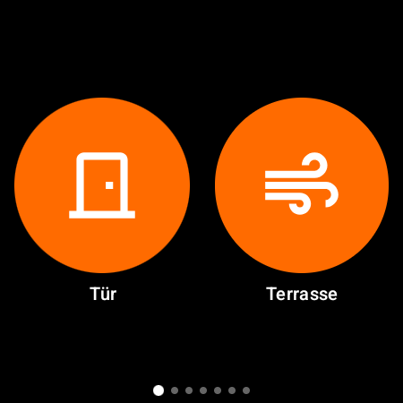
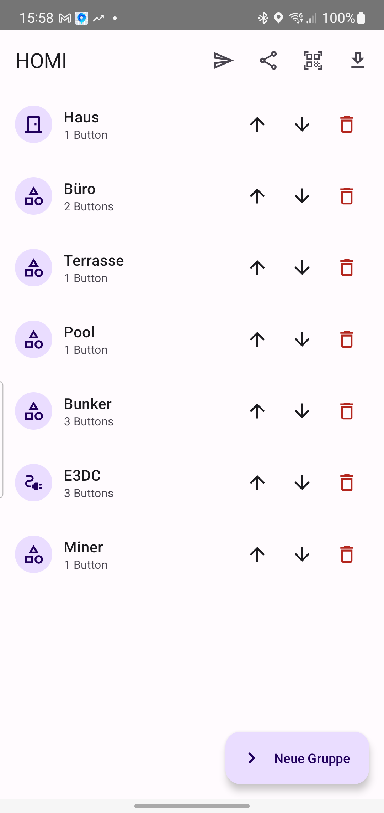
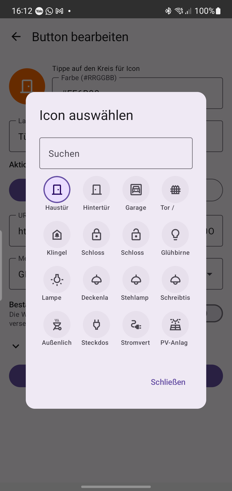
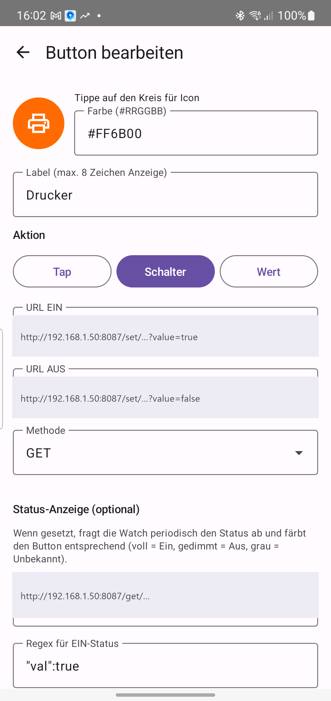
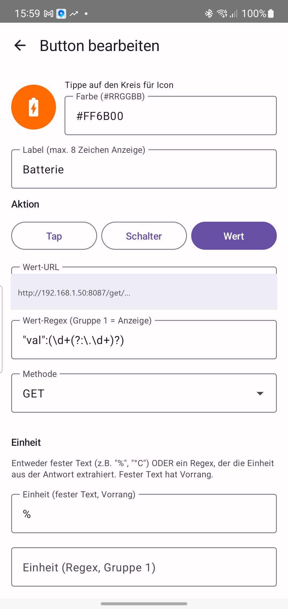

# HOMI

[](https://github.com/Flying-Bolt/HOMI/releases/latest)
[](LICENSE)

**Dein Smart-Home auf dem Handgelenk.** HOMI ist eine Wear-OS-App (plus Smartphone-Begleiter), mit der du Geräte in deinem Zuhause per einfachem HTTP-Aufruf direkt von der Uhr steuerst — Türöffner, Licht, Steckdosen, Rollläden, und mehr. Und du kannst dir **Live-Werte** anzeigen lassen: Batterie-Ladestand, Temperaturen, aktuelle Leistung. Funktioniert mit allem, was sich über eine URL ansprechen lässt: **Tasmota, Shelly, ioBroker (simple-api)** und ähnliche.

<p align="center">
  
</p>

> Dies ist die öffentliche **Download- & Anleitungs-Seite**. Der Quellcode liegt in einem separaten, privaten Repository.

---

## Inhalt

- [Was HOMI kann](#was-homi-kann)
- [So funktioniert's (Konzept)](#so-funktioniert-das-konzept)
- [Download](#download)
- [Installation](#installation)
- [Buttons konfigurieren](#buttons-konfigurieren)
  - [🔘 Tap — eine Aktion auslösen](#-tap--eine-aktion-auslösen)
  - [🔀 Schalter — Ein/Aus mit Status](#-schalter--einaus-mit-status)
  - [📊 Wert — Live-Werte anzeigen](#-wert--live-werte-anzeigen)
- [HTTP-Grundlagen](#http-grundlagen)
- [Reguläre Ausdrücke — die Geheimwaffe](#reguläre-ausdrücke--die-geheimwaffe)
- [🍳 Praxis-Kochbuch](#-praxis-kochbuch)
- [Tipps & Fehlersuche](#tipps--fehlersuche)
- [Hinweise & Einschränkungen](#hinweise--einschränkungen)
- [Lizenz](#lizenz)

---

## Was HOMI kann

- **Frei konfigurierbare Buttons** auf der Uhr, in Gruppen organisiert (horizontal wischen).
- **Drei Button-Typen** — für jeden Zweck der richtige:
  - **🔘 Tap** – ein Druck löst eine URL aus (Tür öffnen, Szene starten, Impuls geben).
  - **🔀 Schalter** – Ein/Aus mit zwei URLs und optionaler Status-Anzeige (Button leuchtet voll = Ein, gedimmt = Aus).
  - **📊 Wert** – zeigt einen Live-Wert aus einer URL an (z. B. `56 %`, `23.4 °C`, `420 W`).
- **Konfiguration am Smartphone**: Buttons anlegen, Icon/Farbe/URL wählen, **direkt testen** — und per Knopfdruck an die Uhr senden.
- **Bestätigung vor Ausführung** (optional, pro Button) — schützt sicherheitskritische Aktionen (Tür, Garage, Tor) vor versehentlichen Taps.
- **Eigenständig auf der Uhr** – läuft auch ohne gekoppeltes Phone weiter, solange WLAN da ist.
- **Lokal & privat** – kein Cloud-Dienst, kein Tracking, keine Konten. HOMI spricht nur die Adressen an, die *du* einträgst.

---

## So funktioniert das (Konzept)

HOMI ist im Kern ganz einfach: Beim Tippen eines Buttons schickt die Uhr einen **HTTP-Request** an eine URL deiner Wahl. Was dort passiert, bestimmt dein Smart-Home-Gerät.

```
   [ Galaxy Watch ]                         [ Dein Gerät im WLAN ]
        HOMI         ──── HTTP GET ────►     Tasmota / Shelly /
   tippt Button                              ioBroker / …
                     ◄─── Antwort ──────     z. B. {"POWER":"ON"}
```

- **Aktion auslösen** (Tap / Schalter): HOMI ruft eine URL auf, die etwas *tut* (z. B. Steckdose einschalten).
- **Status/Wert lesen** (Schalter-Status / Wert): HOMI ruft eine URL auf, die etwas *zurückgibt*, und liest mit einem **regulären Ausdruck** den interessanten Teil aus der Antwort heraus.

Mehr ist es nicht — aber damit lässt sich erstaunlich viel bauen. 👇

---

## Download

Alle Releases findest du unter **[Releases](https://github.com/Flying-Bolt/HOMI/releases/latest)**. Es gibt zwei APKs:

| Datei | Gerät |
|---|---|
| `HOMI-mobile-*.apk` | Android-Smartphone (Begleiter-App zur Konfiguration) |
| `HOMI-wear-*.apk`   | Galaxy Watch / Wear-OS-Gerät |

> ℹ️ Die APKs sind **mit dem Standard-Android-Debug-Key signiert**, damit du sie ohne Play-Store-Schlüssel direkt installieren kannst. Für die private Nutzung im eigenen Netz ist das völlig in Ordnung.

---

## Installation

### 1. Phone-App (Smartphone)

1. Auf dem Phone die [Release-Seite](https://github.com/Flying-Bolt/HOMI/releases/latest) öffnen und die `HOMI-mobile-*.apk` herunterladen.
2. Im Browser/Datei-Manager auf die APK tippen.
3. Android fragt nach **„Installation aus unbekannten Quellen"** – der jeweiligen App (z. B. Chrome, Files) die Erlaubnis erteilen.
4. Installieren → App startet als **HOMI**.

### 2. Watch-App (Galaxy Watch / Wear OS)

Wear OS bietet **keinen direkten APK-Installer auf der Uhr** – die App wird per ADB „sideloaded". Einmalig etwas Aufwand, danach läuft's.

**Vorbereitung auf der Uhr:** Einstellungen → Watch-Info → Software-Info → **Build-Nummer 7× tippen** (schaltet Entwickleroptionen frei) → Entwickleroptionen → **WLAN-Debugging** aktivieren.

**Auf dem PC** (mit installierten [Android Platform-Tools](https://developer.android.com/tools/releases/platform-tools)):

```bash
# 1. PC und Uhr im gleichen WLAN. Auf der Uhr:
#    Entwickleroptionen → WLAN-Debugging → "Gerät mit Pairing-Code koppeln"
#    -> zeigt IP:PORT (Pairing) und einen 6-stelligen Code.
adb pair <IP>:<PAIRING-PORT>        # Code eingeben

# 2. Verbinden (der WLAN-Debugging-Hauptschirm zeigt einen ANDEREN IP:PORT):
adb connect <IP>:<DEBUG-PORT>

# 3. APK aus dem Release installieren:
adb -s <IP>:<DEBUG-PORT> install -r HOMI-wear-*.apk
```

> Pairing-Port und Debug-Port sind **zwei verschiedene Ports**. Bei älteren Wear-Geräten (vor Wear OS 4) entfällt der Pairing-Schritt – dort genügt `adb connect <IP>:<PORT>`.

---

## Buttons konfigurieren

Alles passiert in der **Phone-App**:

1. **Gruppe** anlegen (z. B. „Türen", „Licht", „Energie") und darin **Buttons** hinzufügen.
2. Pro Button: **Icon**, **Farbe**, **Typ** (Tap / Schalter / Wert) und die **URL(s)** wählen.
3. Mit dem **Testen**-Button prüfen, ob alles antwortet. ✅
4. Oben auf das **Senden-Symbol (✈)** tippen → die Konfiguration wandert auf die Uhr.

<p align="center">
  <br>
  <sub>Die Gruppen-Übersicht in der Phone-App. Oben: Senden (✈), Teilen, QR-Import, Datei-Import.</sub>
</p>

<p align="center">
  <br>
  <sub>Der Icon-Picker: kuratierte Symbole für Türen, Licht, Energie, Sensoren u. v. m. — durchsuchbar.</sub>
</p>

> 💡 In allen folgenden Beispielen ist `192.168.1.50` nur ein Platzhalter — ersetze ihn durch die IP deines Geräts. Leerzeichen in URLs werden als `%20` geschrieben.

---

### 🔘 Tap — eine Aktion auslösen

Der einfachste Typ: **ein Druck = ein Request.** Kein Status, keine Rückmeldung außer „hat geklappt / Fehler".

**Du brauchst nur:** eine **URL**.

**Beispiel — Türöffner per Tasmota-Impuls:**
```
URL:   http://192.168.1.50/cm?cmnd=Power%20On
```

**Beispiel — Szene/Skript in ioBroker starten:**
```
URL:   http://192.168.1.50:8087/set/0_userdata.0.szene_kino?value=true
```

> 🔒 **Tipp für Tür/Garage/Tor:** Schalte im Editor **„Bestätigung vor Ausführung"** ein. Dann fragt die Uhr vor dem Auslösen kurz nach — kein versehentliches Öffnen mehr.

---

### 🔀 Schalter — Ein/Aus mit Status

Ein Schalter hat **zwei Aktionen** (Ein und Aus) und kann optional den **aktuellen Zustand anzeigen**: voll leuchtend = Ein, gedimmt = Aus, grau = unbekannt.

<p align="center">
  <br>
  <sub>Schalter im Editor — URL EIN/AUS, optionale Status-URL + Regex. (URLs hier durch Platzhalter ersetzt.)</sub>
</p>

**Du brauchst:**

| Feld | Pflicht? | Wofür |
|---|---|---|
| **URL EIN** | ✅ | wird beim Einschalten aufgerufen |
| **URL AUS** | ✅ | wird beim Ausschalten aufgerufen |
| **Status-URL** | optional | wird periodisch abgefragt, um den Zustand zu erkennen |
| **Regex EIN** / **Regex AUS** | wenn Status-URL gesetzt | erkennen „Ein" bzw. „Aus" in der Antwort (siehe [Regex-Kapitel](#reguläre-ausdrücke--die-geheimwaffe)) |
| **Polling-Intervall** | – | wie oft der Status geholt wird (0 / 10 / 30 / 60 s) |

So funktioniert die Status-Erkennung: HOMI ruft die **Status-URL** auf und prüft die Antwort — **passt „Regex EIN", ist der Schalter an; passt „Regex AUS", ist er aus.**

**Beispiel — Tasmota-Steckdose mit Status:**
```
URL EIN:     http://192.168.1.50/cm?cmnd=Power%20On
URL AUS:     http://192.168.1.50/cm?cmnd=Power%20Off
Status-URL:  http://192.168.1.50/cm?cmnd=Power
   Antwort:  {"POWER":"ON"}
Regex EIN:   "POWER":"ON"
Regex AUS:   "POWER":"OFF"
```

**Beispiel — Shelly (Gen2 / Plus):**
```
URL EIN:     http://192.168.1.51/rpc/Switch.Set?id=0&on=true
URL AUS:     http://192.168.1.51/rpc/Switch.Set?id=0&on=false
Status-URL:  http://192.168.1.51/rpc/Switch.GetStatus?id=0
   Antwort:  {"id":0,"output":true,"apower":42.5, ...}
Regex EIN:   "output":true
Regex AUS:   "output":false
```

**Beispiel — ioBroker-Datenpunkt (simple-api):**
```
URL EIN:     http://192.168.1.50:8087/set/zigbee.0.abcd.state?value=true
URL AUS:     http://192.168.1.50:8087/set/zigbee.0.abcd.state?value=false
Status-URL:  http://192.168.1.50:8087/get/zigbee.0.abcd.state
   Antwort:  {"val":true, ...}
Regex EIN:   "val":true
Regex AUS:   "val":false
```

> ⚠️ **Häufigste Stolperfalle bei ioBroker:** Die **Status-URL muss `/get/`** sein, **nicht** `/set/`! `/set/` *schreibt* den Wert (und liefert HTTP 422 zurück) — `/get/` *liest* ihn. Wenn der Button grau bleibt oder erst nach mehrmaligem Drücken reagiert, ist fast immer die Status-URL oder das Regex schuld → mit **„Status testen"** prüfen.

---

### 📊 Wert — Live-Werte anzeigen

Ein Wert-Button **schaltet nichts** — er **zeigt eine Zahl** aus deinem Smart-Home, z. B. `56 %`, `23.4 °C`, `420 W`. Ein Tap aktualisiert ihn sofort, dazwischen pollt HOMI im eingestellten Intervall.

<p align="center">
  <br>
  <sub>Wert im Editor — Wert-URL, Wert-Regex (Fang-Gruppe 1) und feste Einheit. (URL hier durch Platzhalter ersetzt.)</sub>
</p>

**Du brauchst:**

| Feld | Pflicht? | Wofür |
|---|---|---|
| **Wert-URL** | ✅ | liefert die Antwort mit dem Wert |
| **Wert-Regex** | ✅ | **Fang-Gruppe 1** = der angezeigte Wert (siehe [Regex-Kapitel](#reguläre-ausdrücke--die-geheimwaffe)) |
| **Einheit (fester Text)** | optional | feste Einheit, z. B. `%`, `°C`, `W` — hat **Vorrang** |
| **Einheit (Regex)** | optional | Einheit aus der Antwort lesen (Fang-Gruppe 1) |
| **Polling-Intervall** | – | 0 = nur beim Tap, sonst 10 / 30 / 60 s |

**Beispiel — Batterie-Ladestand (ioBroker):**
```
Wert-URL:    http://192.168.1.50:8087/get/e3dc.0.EMS.BAT_SOC
   Antwort:  {"val":56, ...}
Wert-Regex:  "val":(\d+(?:\.\d+)?)      →  zeigt  56
Einheit:     %                          →  Anzeige:  56 %
```

**Beispiel — Temperatur (Tasmota-Sensor):**
```
Wert-URL:    http://192.168.1.50/cm?cmnd=Status%2010
   Antwort:  ... "Temperature":23.4 ...
Wert-Regex:  "Temperature":([\d.]+)     →  zeigt  23.4
Einheit:     °C                          →  Anzeige:  23.4 °C
```

**Beispiel — Aktuelle Leistung (Shelly):**
```
Wert-URL:    http://192.168.1.51/rpc/Switch.GetStatus?id=0
   Antwort:  ... "apower":420.7 ...
Wert-Regex:  "apower":([\d.]+)          →  zeigt  420.7
Einheit:     W                           →  Anzeige:  420.7 W
```

**Bonus — Einheit aus der Antwort lesen** (statt fest eintippen):
```
   Antwort:  ... "val":56,"unit":"%" ...
Wert-Regex:    "val":(\d+)              →  56
Einheit-Regex: "unit":"([^"]+)"         →  %
```

---

## HTTP-Grundlagen

Du musst kein Profi sein — aber diese vier Dinge helfen:

- **GET vs. POST** (Feld „Methode"): Die allermeisten Smart-Home-URLs funktionieren mit **GET** (Standard). **POST** brauchst du nur, wenn dein Gerät es verlangt (dann kannst du unter *Erweitert* einen **Body** mitschicken).
- **`%20` = Leerzeichen:** URLs vertragen keine echten Leerzeichen. `Power On` wird zu `Power%20On`.
- **Header** (unter *Erweitert*, eine pro Zeile als `Key: Wert`): nötig z. B. für eine **Authentifizierung**:
  ```
  Authorization: Bearer dein-token-hier
  ```
- **Port:** ioBroker simple-api läuft typischerweise auf `:8087`, Tasmota/Shelly auf dem Standard-Port (kein `:` nötig).

---

## Reguläre Ausdrücke — die Geheimwaffe

„Regex" klingt nach Zauberei, ist aber nur eine **Suchschablone**: Du beschreibst, *wie* der gesuchte Text aussieht, und HOMI findet ihn in der Antwort deines Geräts. Zwei Anwendungen:

1. **Schalter-Status:** Das Regex muss in der Antwort **irgendwo vorkommen** (kein exakter Treffer nötig). Kommt „Regex EIN" vor → an; kommt „Regex AUS" vor → aus.
2. **Wert anzeigen:** Hier zählt die **Fang-Gruppe** — der Teil in **runden Klammern `( )`**. Genau dieser Teil wird als Wert angezeigt.

### Der Spickzettel

| Muster | Bedeutung | matcht z. B. |
|---|---|---|
| `\d` | eine Ziffer (0–9) | `4` |
| `\d+` | eine oder mehr Ziffern | `420` |
| `\.` | ein echter Punkt | `.` |
| `[\d.]+` | Ziffern **und** Punkt | `23.4` |
| `\d+(?:\.\d+)?` | Ganzzahl **oder** Dezimalzahl | `56` oder `56.5` |
| `-?\d+` | optional negativ | `-7` |
| `[^"]+` | alles außer Anführungszeichen | `kWh` |
| `\s*` | beliebig viele Leerzeichen | (auch keine) |
| `true\|false` | das eine **oder** das andere | `true` |
| `( … )` | **Fang-Gruppe** = angezeigter Wert | |

### Von der Antwort zum Regex

Schau dir die Antwort deines Geräts an (am besten direkt im Browser aufrufen) und „umschreibe" den interessanten Teil:

```
Antwort:     {"val":56.5,"ack":true}
Ziel:        die 56.5
Regex:       "val":([\d.]+)
                    └─────┘  Fang-Gruppe → 56.5
```

```
Antwort:     {"POWER":"ON"}
Ziel:        erkennen, dass es AN ist
Regex EIN:   "POWER":"ON"      (muss vorkommen → an)
Regex AUS:   "POWER":"OFF"
```

> 🧪 **Du musst nichts raten:** Der Editor hat zu jedem Typ einen **Test-Button** („Status testen" / „Wert holen"). Er ruft live deine URL auf und zeigt, was erkannt wurde — Regex anpassen, nochmal testen, fertig.

> 💡 **Robustheit:** Halte Regex so locker wie nötig. `"val":\s*true` matcht auch `"val": true` (mit Leerzeichen). Für Werte ist `([\d.]+)` meist robuster als eine exakte Zahl.

---

## 🍳 Praxis-Kochbuch

Fertige Rezepte zum Abtippen — IP anpassen, fertig.

<details>
<summary><b>Steckdose schalten (Tasmota) — mit Status-Anzeige</b></summary>

```
Typ:         Schalter
URL EIN:     http://192.168.1.50/cm?cmnd=Power%20On
URL AUS:     http://192.168.1.50/cm?cmnd=Power%20Off
Status-URL:  http://192.168.1.50/cm?cmnd=Power
Regex EIN:   "POWER":"ON"
Regex AUS:   "POWER":"OFF"
Intervall:   30 s
```
</details>

<details>
<summary><b>Licht schalten (Shelly Plus) — mit Status-Anzeige</b></summary>

```
Typ:         Schalter
URL EIN:     http://192.168.1.51/rpc/Switch.Set?id=0&on=true
URL AUS:     http://192.168.1.51/rpc/Switch.Set?id=0&on=false
Status-URL:  http://192.168.1.51/rpc/Switch.GetStatus?id=0
Regex EIN:   "output":true
Regex AUS:   "output":false
Intervall:   30 s
```
</details>

<details>
<summary><b>Beliebigen Datenpunkt schalten (ioBroker)</b></summary>

```
Typ:         Schalter
URL EIN:     http://192.168.1.50:8087/set/DEIN.DATENPUNKT?value=true
URL AUS:     http://192.168.1.50:8087/set/DEIN.DATENPUNKT?value=false
Status-URL:  http://192.168.1.50:8087/get/DEIN.DATENPUNKT     ← /get/, nicht /set/!
Regex EIN:   "val":true
Regex AUS:   "val":false
Intervall:   30 s
```
</details>

<details>
<summary><b>Batterie-Ladestand anzeigen (ioBroker)</b></summary>

```
Typ:         Wert
Wert-URL:    http://192.168.1.50:8087/get/DEIN.BAT_SOC
Wert-Regex:  "val":(\d+(?:\.\d+)?)
Einheit:     %
Intervall:   60 s
```
</details>

<details>
<summary><b>Temperatur anzeigen (Tasmota / Shelly)</b></summary>

```
Typ:         Wert
Wert-URL:    http://192.168.1.50/cm?cmnd=Status%2010
Wert-Regex:  "Temperature":([\d.]+)
Einheit:     °C
Intervall:   60 s
```
</details>

<details>
<summary><b>Garagentor öffnen (Tap, mit Sicherheits-Rückfrage)</b></summary>

```
Typ:         Tap
URL:         http://192.168.1.50/cm?cmnd=Power%20On
Bestätigung vor Ausführung:  AN   ← fragt vor dem Öffnen nach
```
</details>

---

## Tipps & Fehlersuche

| Symptom | Ursache & Lösung |
|---|---|
| **Button bleibt grau / „?"** | Status-URL oder Regex passt nicht. Bei ioBroker: `/get/` statt `/set/`. → **„Status testen"** im Editor. |
| **HTTP 422 / 400** | Falscher Endpoint — typisch `/set/` als Status-URL bei ioBroker. Auf `/get/` ändern. |
| **„Zeitüberschreitung"** | Gerät nicht erreichbar: IP falsch, Gerät aus, oder Uhr nicht im richtigen WLAN. |
| **Wert zeigt „—"** | Wert-Regex matcht nicht. → **„Wert holen"**, Antwort ansehen, Regex anpassen (oft hilft `([\d.]+)`). |
| **Roter „Kein WLAN" trotz WLAN** | In v2.3.6 behoben — auf die aktuelle Version aktualisieren. |
| **Schalter reagiert erst nach mehrmaligem Tippen** | In v2.3.4 behoben — bitte aktualisieren. |
| **Label abgeschnitten** | Auf der Uhr werden max. **8 Zeichen** angezeigt — kurze Labels wählen. |

> 🧰 **Goldene Regel:** Jede URL lässt sich vorab **im Browser** testen (einfach aufrufen) und im **Editor** mit dem Test-Button prüfen, *bevor* du an die Uhr sendest.

---

## Hinweise & Einschränkungen

- HOMI steuert **lokale Geräte im eigenen Netz** (HTTP). Externe/HTTPS-URLs gehen ebenfalls, wenn das Zielgerät sie unterstützt.
- Im **Energiesparmodus** schaltet Wear OS das WLAN ab und blockiert Apps daran, es zu reaktivieren – HOMI kann das nicht umgehen und zeigt dann einen Hinweis.
- Keine Telemetrie, keine Cloud, keine Konten. Deine URLs und Tokens bleiben auf deinen Geräten.

---

## Lizenz

[Apache License 2.0](LICENSE) — siehe auch [NOTICE](NOTICE).

<sub>🤖 App & Doku mitentwickelt mit <a href="https://claude.com/claude-code">Claude Code</a> (Opus 4.8).</sub>
